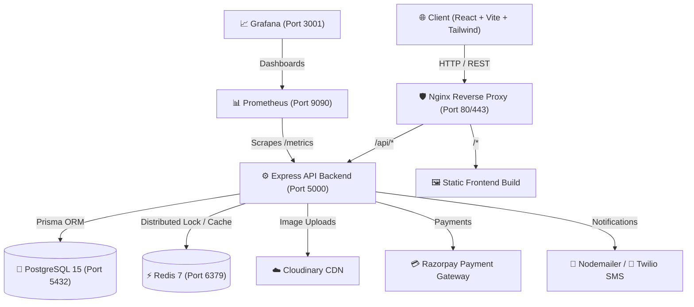

# 🏨 StayNest — Full-Stack Hotel & Stay Booking Platform

[](https://react.dev/)
[](https://vitejs.dev/)
[](https://nodejs.org/)
[](https://expressjs.com/)
[](https://www.prisma.io/)
[](https://www.postgresql.org/)
[](https://redis.io/)
[](https://www.docker.com/)

**StayNest** is a production-ready, full-stack two-sided marketplace for property stays and hotel reservations. Designed for modern scalability, it connects **Guests**, **Hosts**, and **Platform Administrators** with real-time room availability, concurrency-safe booking logic, Razorpay payment processing, and comprehensive observability metrics.

---

## 📐 System Architecture



---

## ✨ Key Features

### 👤 Guest Experience
- **Smart Search & Filters**: Search stays by location, price range, room amenities, and check-in/out dates.
- **Interactive Maps**: Browse listings visually using Leaflet & OpenStreetMap integration.
- **Add-on Services**: Customize bookings with airport pickup categories and dining plan packages.
- **Coupon & Discounts**: Real-time coupon validation with GST tax breakdown calculations.
- **Wishlists & Reviews**: Save favorite properties and write detailed reviews with image attachments.

### 🏠 Host Management
- **Property Lifecycle**: Draft, publish, or pause property listings with multi-image Cloudinary upload.
- **Dynamic Pricing & Calendar**: Configure custom daily rates and block unavailable room dates.
- **Host Analytics Dashboard**: Track incoming reservations, total earnings, occupancy rates, and guest reviews.
- **Review Replies**: Respond directly to guest reviews on published properties.

### 🛡️ Admin Controls
- **Global Overview**: Monitor total platform revenue, active users, total properties, and booking metrics.
- **Property Moderation**: Review, approve, suspend, or reactivate host listings.
- **User Governance**: Activate, suspend, or ban user accounts.
- **Financial Controls**: Process manual refunds for disputed or cancelled reservations.

### ⚡ Core Engineering Highlights
- **Concurrency-Safe Booking**: Distributed Redis locks prevent double-booking of rooms under high concurrency.
- **Dual JWT Authentication**: Short-lived Access Tokens with HTTP-only Refresh Cookies & OTP mobile/email verification.
- **Razorpay Integration**: Idempotent webhook handling with cryptographic HMAC signature verification.
- **Structured Logging & Sentry**: Pino/Winston logging with integrated Sentry error tracing.
- **Prometheus Metrics**: Pre-configured HTTP metrics (`/metrics`) and Grafana monitoring dashboard.

---

## 🛠️ Tech Stack

### Frontend (`/client`)
- **Core Framework**: React 18 (Vite build setup)
- **Styling**: Tailwind CSS, PostCSS, Lucide React icons
- **State Management**: Zustand & React Query (`@tanstack/react-query`)
- **Mapping & Charts**: Leaflet, React-Leaflet, Recharts
- **UI & Animations**: Framer Motion, React Hot Toast, React Datepicker

### Backend (`/server`)
- **Runtime**: Node.js v20+ & Express.js
- **Database & ORM**: PostgreSQL 15 & Prisma ORM v5
- **Caching & Locking**: Redis 7 via `ioredis`
- **Security**: Helmet, Rate Limiting, CORS, Bcrypt.js, JsonWebToken
- **Media & Communications**: Cloudinary, Multer, Nodemailer, Twilio SDK
- **Observability**: `prom-client` (Prometheus), Pino logger, Sentry

### Infrastructure & DevOps
- **Containerization**: Docker & Docker Compose (`docker-compose.yml`)
- **Proxy**: Nginx (Reverse proxy, Gzip compression, SSL termination)
- **Monitoring**: Prometheus & Grafana pre-provisioned dashboards

---

## 📂 Repository Structure

```
Full-Stack_Hotel_Booking_Platform/
├── client/                     # Frontend React SPA
│   ├── src/                    # Components, pages, hooks, services, state
│   ├── public/                 # Static public assets
│   ├── tailwind.config.js      # Design tokens and styling configuration
│   └── vite.config.js          # Vite build configuration
├── server/                     # Backend Express REST API
│   ├── prisma/                 # Database schema & seed scripts
│   ├── src/
│   │   ├── controllers/        # Request handlers (Auth, Bookings, Properties, etc.)
│   │   ├── middlewares/        # Auth, Validation, Error Handler, Rate Limiter
│   │   ├── routes/             # Express route declarations
│   │   ├── services/           # Redis locking, Razorpay, Cloudinary services
│   │   └── app.js              # Express app setup & middleware stack
│   └── __tests__/              # API unit & integration tests
├── nginx/                      # Reverse proxy setup
├── monitoring/                 # Prometheus config & Grafana dashboards
├── docker-compose.yml          # Multi-container orchestration
└── .env.example                # Template for environment variables
```

---

## 🚀 Quick Start & Setup Guide

### 1. Prerequisites
- [Docker & Docker Compose](https://www.docker.com/get-started/)
- [Node.js v20+](https://nodejs.org/) (for local non-docker execution)

### 2. Environment Setup
Copy the example environment file:
```bash
cp .env.example .env
```
Update `.env` with your preferred credentials (JWT secrets, Cloudinary credentials, Razorpay API keys, Twilio/SMTP details).

### 3. Run with Docker Compose (Recommended)
Spin up PostgreSQL, Redis, Express API, Nginx, Prometheus, and Grafana in a single command:
```bash
docker-compose up --build -d
```

#### Application Endpoints:
- **Frontend App**: [http://localhost](http://localhost) (or `http://localhost:3000`)
- **API Server**: [http://localhost/api](http://localhost/api) (or `http://localhost:5000/api`)
- **Health Check**: [http://localhost:5000/health](http://localhost:5000/health)
- **Prometheus Metrics**: [http://localhost:9090](http://localhost:9090)
- **Grafana Dashboard**: [http://localhost:3001](http://localhost:3001) *(Default login: `admin` / `staynest_grafana`)*

### 4. Database Migration & Seeding
To populate the database with initial seed data (properties, rooms, and test users):
```bash
# Exec into running server container or run locally
docker-compose exec server npx prisma migrate deploy
docker-compose exec server npm run prisma:seed
```

#### 🔑 Pre-seeded Test Accounts:
| Role | Email | Password |
| :--- | :--- | :--- |
| **Administrator** | `admin@staynest.com` | `Admin@123` |
| **Host** | `host@staynest.com` | `Host@123` |
| **Guest** | `guest@staynest.com` | `Guest@123` |

---

## 📡 Primary API Endpoints Overview

| Method | Endpoint | Description | Access |
| :--- | :--- | :--- | :--- |
| `POST` | `/api/auth/register` | Register a new user | Public |
| `POST` | `/api/auth/login` | Authenticate user & return tokens | Public |
| `GET` | `/api/properties` | Search and filter published properties | Public |
| `GET` | `/api/properties/:id` | Get detailed property & room availability | Public |
| `POST` | `/api/properties` | Create a new property listing | Host |
| `POST` | `/api/bookings` | Create a room reservation with lock | Guest |
| `POST` | `/api/payments/create-order` | Generate Razorpay order ID | Guest |
| `POST` | `/api/payments/verify` | Verify Razorpay payment signature | Guest |
| `POST` | `/api/payments/webhook` | Idempotent Razorpay webhook listener | Service |
| `GET` | `/api/dashboard/host` | Fetch host earnings & reservation stats | Host |
| `GET` | `/api/dashboard/admin` | Fetch system-wide metrics & pending actions | Admin |

---

## 🧪 Testing & Quality Assurance

### Run Server Unit & Integration Tests:
```bash
cd server
npm install
npm test
```

### Run Client Tests & Linter:
```bash
cd client
npm install
npm run test
npm run lint
```

---

## 📊 Monitoring & Observability

- **Metrics Collection**: Express exposes Prometheus metrics at `GET /metrics`.
- **Grafana Visualization**: Connects automatically to Prometheus to display request rates, latency percentiles, error rates, and active database connections.

---

## 📄 License

This project is licensed under the **MIT License**.

